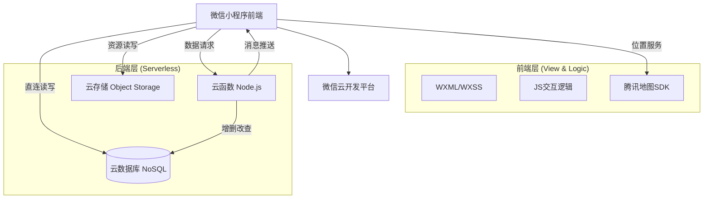

# 职场速约 - 基于微信云开发的智能招聘平台


> **项目性质**：毕业设计 / 微信小程序全栈开发  
> **核心理念**：基于地理位置与智能算法，搭建高效、便捷的求职招聘双向匹配桥梁。

---

## 📋 目录

1. [项目概述](#1-项目概述)
2. [技术架构](#2-技术架构)
3. [核心功能模块](#3-核心功能模块)
4. [数据库设计](#4-数据库设计)
5. [关键技术与算法实现](#5-关键技术与算法实现)
6. [云函数与API接口](#6-云函数与api接口)
7. [部署与运行指南](#7-部署与运行指南)

---

## 1. 项目概述

### 1.1 项目简介
**"职场速约"** 是一款基于微信云开发（CloudBase）的原生小程序，旨在解决传统招聘平台信息匹配度低、地理位置感知弱的问题。系统创新性地融合了**LBS地理位置服务**与**多维度智能匹配算法**，为求职者提供"就近找工作"和"精准推荐"的双重体验，同时为企业提供高效的人才筛选工具。

### 1.2 核心特色功能
| 功能模块 | 创新点说明 |
| :--- | :--- |
| 🎯 **五维智能匹配** | 综合分析简历与JD的期望岗位(35%)、城市(15%)、薪资(20%)、技能(20%)、证书(10%)，输出精准匹配度。 |
| 📍 **LBS就近推荐** | 集成腾讯地图SDK，实现基于地理位置的职位检索，优先推荐"家门口"的好工作。 |
| 🔄 **全量数据检索** | 自研递归分页查询算法，突破小程序云数据库单次20条的限制，支持海量数据筛选。 |
| 📹 **视频化招聘** | 支持企业上传宣传短视频，以更直观的多媒体形式展示工作环境。 |
| 🏆 **技能认证体系** | 内置在线考试系统，自动判分并颁发初/中/高级电子技能证书，提升简历含金量。 |
| 📊 **薪资大数据** | 提供多维度的薪资分析报告（分位数统计），辅助求职者进行科学定价。 |

### 1.3 项目配置信息
- **AppID**: `wx9e3d106a68118f81`
- **云环境ID**: `cloud1-2gkavmfje2c8e8c0`
- **地图服务**: 腾讯位置服务 (Key: `KM5BZ-AK4C5...`)
- **开发工具**: 微信开发者工具 (Stable 1.06+)

---

## 2. 技术架构

### 2.1 整体架构设计
项目采用 **Serverless 无服务架构**，依托微信云开发提供的一站式后端服务，实现免运维、高并发、低成本的系统运行。



### 2.2 技术栈详解
- **前端框架**: 微信小程序原生框架 (WXML / WXSS / ES6+)
- **后端服务**: 微信云开发 (Cloud Functions / Cloud Database)
- **位置服务**: 腾讯地图 WX-JSSDK
- **数据存储**: JSON文档型数据库
- **UI设计**: Flex布局 + CSS3动画 + 响应式设计

---

## 3. 核心功能模块

### 3.1 求职者端 (Candidate)
1.  **首页推荐**:
    *   **附近岗位**: 自动定位，按直线距离由近及远排序。
    *   **智能匹配**: 基于简历画像，自动计算人岗匹配得分，优先展示高分岗位。
    *   **薪资分析**: 查看不同行业、城市的薪资水平分布。
2.  **简历中心**: 支持在线编辑个人信息、求职意向、教育/工作经历及技能标签。
3.  **技能考试**: 随机抽题考试，及格后自动生成电子证书并展示在简历中。
4.  **求职管理**: 查看我的投递、面试邀约、收藏记录等。

### 3.2 企业端 (Company)
1.  **职位管理**: 发布、编辑、下架职位，支持视频上传和地点标注。
2.  **人才筛选**: 查看投递简历，支持按匹配度排序筛选。
3.  **面试管理**: 发起面试邀请，确认面试时间，发送面试结果通知（订阅消息）。
4.  **企业认证**: 上传营业执照进行资质审核，确保平台职位真实性。

---

## 4. 数据库设计

### 4.1 核心集合 (Collections)

| 集合名 | 描述 | 关键字段示例 |
| :--- | :--- | :--- |
| `users` | 用户表 | `_id`, `openid`, `role`(角色), `resume`(简历对象), `companyInfo` |
| `jobs` | 职位表 | `title`, `salaryMin`, `salaryMax`, `location`({lat, lng}), `tags`, `status` |
| `applications` | 投递记录 | `jobId`, `candidateId`, `status`(submitted/viewed/hired), `createTime` |
| `interviews` | 面试记录 | `applicationId`, `time`, `address`, `result`, `status` |
| `skill_certificates`| 证书表 | `userId`, `category`, `level`(初/中/高级), `score` |
| `skill_questions` | 考试题库 | `category`, `question`, `options`, `answer`, `difficulty` |
| `skill_exam_records`| 考试记录 | `userId`, `category`, `score`, `answers`, `createTime` |

### 4.2 数据模型示例 (Job)
```json
{
  "_id": "job_123456",
  "companyId": "user_789",
  "title": "高级前端工程师",
  "salaryMin": 15,
  "salaryMax": 25,
  "tags": ["Vue", "React", "小程序"],
  "location": {
    "address": "北京市海淀区...",
    "latitude": 39.9,
    "longitude": 116.3
  },
  "status": "active",
  "createTime": "Date(2025-12-01...)"
}
```

---

## 5. 关键技术与算法实现

### 5.1 全量数据递归获取算法
**问题背景**: 小程序端直接请求数据库默认限制20条记录，导致"附近"或"匹配"排序时无法基于全量数据计算，造成结果不准确。
**解决方案**: 实现 `getAllActiveJobs` 递归函数，自动分批拉取所有状态为 `active` 的职位数据至本地内存，再进行统一的算法处理。

```javascript
// 核心代码逻辑
getAllActiveJobs() {
  return new Promise((resolve) => {
    const list = [];
    const fetch = (skip) => {
      db.collection('jobs').skip(skip).limit(20).get().then(res => {
        list.push(...res.data);
        if (res.data.length === 20) fetch(skip + 20); // 递归
        else resolve(list); // 完成
      });
    };
    fetch(0);
  });
}
```

### 5.2 五维智能匹配算法
系统将人岗匹配度量化为 0-100 的分值，算法权重配置如下：

1.  **期望岗位 (35%)**: 使用模糊字符串匹配算法，计算简历意向与JD标题的相似度。
2.  **薪资范围 (20%)**: 计算求职者期望薪资区间与企业提供区间的重叠率 (IoU)。
3.  **技能标签 (20%)**: 计算双方技能Tags的交集比例。
4.  **工作城市 (15%)**: 简单的布尔匹配及区域包含匹配。
5.  **技能证书 (10%)**: 持有高级/中级/初级证书分别获得不同加权分。

### 5.3 LBS 地理位置计算
前端利用 `wx.getLocation` 获取用户实时经纬度，结合腾讯地图 SDK 的 `calculateDistance` 接口批量计算用户与所有职位的直线距离，并按距离由近到远排序展示。

---

## 6. 云函数与API接口

项目主要包含两大核心云函数：

### 6.1 `userInit` (用户模块)
*   **功能**: 处理用户注册、登录、信息同步。
*   **逻辑**: 自动获取微信 OpenID，防止重复注册，区分企业与求职者角色，初始化用户基础文档。

### 6.2 `quickstartFunctions` (业务聚合)

| 接口名 | 功能描述 |
| :--- | :--- |
| `getOpenId` | 获取用户的 OpenID、AppID、UnionID 等基础身份信息 |
| `getMiniProgramCode` | 生成小程序二维码并上传至云存储 |
| `matchJobs` | 服务端岗位匹配算法，综合城市、技能、薪资计算匹配度 |
| `sendInterviewNotice` | 发送面试邀请通知（订阅消息） |
| `sendInterviewResult` | 发送面试结果通知（录用/拒绝） |
| `sendSubscribeMessage` | 通用订阅消息发送接口，支持企业和求职者双端 |
| `cancelApplication` | 取消/撤回投递记录 |

> **设计说明**: 匹配算法同时在前端和云端实现。前端计算用于实时反馈，云端计算作为API能力备用，可减轻前端计算压力。

---

## 7. 部署与运行指南

### 7.1 环境准备
1.  安装 **Node.js** (v12+) 和 **微信开发者工具**。
2.  开通微信云开发环境，获取环境 ID。
3.  申请腾讯地图 API Key。

### 7.2 部署步骤
1.  **导入项目**: 将 `miniprogram-1` 目录导入开发者工具。
2.  **配置环境**:
    *   修改 `miniprogram/app.js` 中的 `env` 为你的云环境 ID。
    *   修改 `miniprogram/app.js` 中的 `qqmapKey` 为你的腾讯地图 Key。
3.  **部署云函数**:
    *   右键 `cloudfunctions/userInit` -> 上传并部署：云端安装依赖。
    *   右键 `cloudfunctions/quickstartFunctions` -> 上传并部署：云端安装依赖。
4.  **初始化数据库**: 在云开发控制台新建 `users`, `jobs`, `applications`, `interviews`, `skill_certificates` 等集合。
5.  **编译运行**: 点击"编译"，即可通过模拟器预览效果。

### 7.3 注意事项
*   需在 `app.json` 配置 `permission` 以获取用户地理位置权限。
*   真机调试时，需打开手机GPS定位。

---

**文档版本**: v2.0 (已优化)  
**适用场景**: 毕业设计 / 课程设计 / 全栈开发演示
